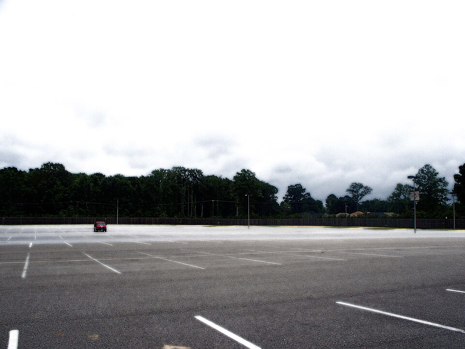
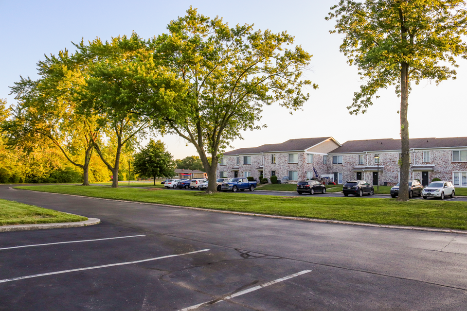

# Day 11 — SVM/360 Fisheye Lab

> ### 🏆 HỒ SƠ NỘP BÀI NHÓM (GROUP SUBMISSION)
> - **Tên nhóm:** **SVM360-AI-Group**
> - **Người đại diện nộp bài:** **Đỗ Trung Kiên** — MSSV: `2A202602283` (Vai C - Lead & Diagnostician)
> - **Repo nhóm chính thức:** [https://github.com/DTKien2005/Day11-SVM360-Fisheye-Lab-Student](https://github.com/DTKien2005/Day11-SVM360-Fisheye-Lab-Student)
> - **Kết quả Gate Check:** `✓ Hồ sơ hình thức đầy đủ` (0 failed gates trong [submission/manifest.json](submission/manifest.json)).
>
> | Thành viên | MSSV | Vai trò | Slice | Bản nhãn đã khóa | Báo cáo QA Review | Rework & Delta | Exit Ticket | Branch / Repo | Commit chốt |
> |---|---|---|---|---|---|---|---|---|---|
> | **Đỗ Trung Kiên** *(Lead)* | 2A202602283 | Vai C (Lead & Diag) | `B4-dense` | [C0 Lock](submission/p1_calib/lock.txt), [Craft Lock](submission/r1_craft/lock.txt) | [QA Review C0](submission/p1_calib/b_review_notes.md), [QA Intake](submission/r2_qa/qa_intake.md) | [Metric & Error Card](submission/10_error_card.md), [Rework v2](submission/rework/lock2.txt) | [50_exit_ticket.md](submission/50_exit_ticket.md) | [main](https://github.com/DTKien2005/Day11-SVM360-Fisheye-Lab-Student/tree/main) | HEAD (main) |
> | **Nguyễn Trí Tín** | 2A202602275 | Vai A (Annotator) | `B4-center` | [r1_craft Lock](submission/r1_craft/lock.txt) (`6997-BF13`) | [Self-QC 9 mục](submission/r1_craft/selfqc.md) | [Lock2](submission/rework/lock2.txt) (`9313-188F`), [delta.md](submission/rework/delta.md) | [Exit Ticket](submission/50_exit_ticket.md) | [p0-parking-export](https://github.com/DTKien2005/Day11-SVM360-Fisheye-Lab-Student/tree/p0-parking-export) | [`ac57504`](https://github.com/DTKien2005/Day11-SVM360-Fisheye-Lab-Student/commit/ac57504969f37fe41f1f2500c2cb3f3007a0b171) |
> | **Võ Trọng Nghĩa** | 2A202602072 | Vai B (QA Reviewer) | `B2-mid` | [Parking Lock](submission/parking/annotations.xml) | [qa_review.md](submission/r2_qa/qa_review.md), [qa_overlay.html](submission/r2_qa/qa_overlay.html) | [QA Overlay PNG](submission/screenshots/qa_B_295948_overlay.png) | [Exit Ticket](submission/50_exit_ticket.md) | [nghia-qa-notes](https://github.com/DTKien2005/Day11-SVM360-Fisheye-Lab-Student/tree/nghia-qa-notes) | [`0503c78`](https://github.com/DTKien2005/Day11-SVM360-Fisheye-Lab-Student/commit/0503c786afa0bd493ca25157b62b31382648a3af) |
>
> **Tóm tắt điều phối & Bàn giao nhóm:**
> - **Phân công công việc:** Vai A (Tín) thực hiện P0 parking, P1 hiệu chuẩn C0, P2 gán nhãn slice B4-center và P5 rework v2. Vai B (Nghĩa) thực hiện P0/P1 review, P3 blind QA review độc lập và trích xuất bằng chứng ảnh overlay thật. Vai C (Kiên) điều phối dự án, benchmark P4 diagnostic (local quality, model YOLO compare, IoU sweep, taxonomy 10_error_card), P6 governance (patch R10, escalation ticket, review/sampling/gold plan, exit ticket) và chạy kiểm tra manifest tổng thể.
> - **Giải quyết bất đồng & Thống nhất kỹ thuật:** Đã xử lý triệt để 4 ca bất đồng chính qua [40_decision_log.csv](submission/40_decision_log.csv), trong đó loại bỏ box Car H=26.99px dưới ngưỡng R01, đồng bộ nhãn `Bike` theo R03, và lập [30_escalation_ticket.md](submission/30_escalation_ticket.md) cho ca biên mép khó tại frame 295948.
> - **Kế hoạch mở rộng:** Thống nhất bảng phân bổ 200 frame cho 4 camera fisheye tại [45_sampling_plan.csv](submission/45_sampling_plan.csv) và tiêu chí gold set đa camera tại [46_gold_set_plan.md](submission/46_gold_set_plan.md).
> - **Hồ sơ chi tiết & cam kết đóng góp:** Xem chi tiết tại **[TEAMMATES.md](TEAMMATES.md)**.


## Bạn sẽ làm gì và nộp gì?

Bạn sẽ giải một vòng công việc dữ liệu: phân biệt vạch **chia ô đỗ** với vạch chỉ lối xe chạy trên ảnh bãi đỗ; gán nhãn object trên ảnh fisheye; tự soát trước khi xem reference; review bài khác theo guideline; đọc xung đột giữa người, reference và model; sửa có căn cứ; rồi lập kế hoạch sampling/gold set cho **front, rear, left, right**. Toàn bộ các phần này nằm trong một buổi lab 240 phút.

Đầu ra cuối là repo cá nhân **Public** chứa các hiện vật trong `submission/`: export CVAT đã khóa, ảnh chụp minh chứng, báo cáo QA, bảng phát hiện lỗi, quyết định rework, phân bổ **200 frame** và kế hoạch gold set. Chạy `python3 lab11.py check` trước khi push. Lệnh kiểm cấu trúc và tính đầy đủ; nhãn và lập luận được đọc theo [rubric 100 điểm](RUBRIC.md), không được máy tự chấm đúng/sai.

Ba nguồn ảnh phục vụ ba câu hỏi khác nhau:

| Nguồn | Bạn dùng để quyết định gì? | Giới hạn |
|---|---|---|
| `assets/parking/parking-lot-core.jpg` và `parking-lot-contrast.png` | Vạch nào chia ô đỗ, vùng trống nào nhìn thấy? | Ảnh camera thường, không có calibration hay ground truth an toàn. |
| 48 ảnh ADASIND đã làm mờ trong `assets/images/` | Box, attribute và vùng ignore trên **một** camera fisheye. | Không đại diện đủ bốn camera SVM. |
| Tình huống 50.000 frame trên slide | Thiết kế lấy mẫu 200 frame và kế hoạch tạo gold set cho bốn camera. | Tình huống giả lập; repo không chứa 50.000 frame. |


*Sơ đồ học khái niệm: một vật ở vùng chồng (seam) có thể xuất hiện trên hai ảnh. Chưa có timestamp, calibration và policy output thì không tự ghép hai box hay gán cùng track ID.*

## Nhìn ảnh trước khi gán nhãn

Ảnh lõi ở dưới có các đoạn sơn chia **ô đỗ**. Hãy tìm hai đoạn như vậy để vẽ `parking_line`; không vẽ mọi vạch trắng thành một lớp. Bản ảnh thứ hai giúp so vạch ô đỗ ở tiền cảnh với lối xe chạy trong bãi. Mở [quy tắc và thao tác parking](GUIDE.md) trước khi tạo task.



*Ảnh thực hành chính: vạch chia các ô nằm trên mặt bãi; xe và dải đường xa không phải lý do để gán toàn bộ vạch sơn cùng một nhãn.*



*Ảnh đối chiếu: vạch ở tiền cảnh chia ô; lối xe chạy giữa hai dãy ô là một vùng khác. Chỉ ảnh lõi được nạp vào task parking của bài bắt buộc.* Nguồn và giấy phép ở [DATA_LICENSES.md](docs/DATA_LICENSES.md).

## Chuẩn bị một lần

### Nếu bạn chưa dùng Terminal hoặc máy không có `make`

Bạn không cần cài `make`. Mở Terminal (Mac) hoặc Command Prompt (Windows) **ngay trong thư mục repo**, nơi có file `lab11.py`, rồi chạy lệnh Python. Trên Mac, trong Terminal gõ `cd ` (có dấu cách), kéo thư mục repo từ Finder vào cửa sổ và nhấn Enter. Trên Windows, mở thư mục repo trong File Explorer, gõ `cmd` vào thanh địa chỉ rồi nhấn Enter.

```bash
# Mac
python3 lab11.py --help
```

```text
# Windows
py lab11.py --help
```

Khi màn hình hiện các lệnh như `doctor`, `cvat` và `check`, bạn đang ở đúng nơi. Từ đây, mọi lệnh trong README dùng `python3`; trên Windows, thay chữ `python3` đầu dòng bằng `py`. [GUIDE.md](GUIDE.md#bắt-đầu-nếu-bạn-chưa-từng-dùng-terminal) hướng dẫn từng cú nhấp, cách kéo thư mục vào Terminal và cách đọc lỗi.

1. Trên [repo Student của Day 11](https://github.com/VinUni-AI20k/Day11-SVM360-Fisheye-Lab-Student), chọn **Use this template → Create a new repository** trong tài khoản của bạn; đặt chế độ **Public** để bài có thể được chấm. Template nguồn hiện còn private trước khi phát lớp; nếu bạn chưa có quyền truy cập, hãy đợi link lớp. Dùng GitHub Desktop hoặc `git clone` để đưa **repo cá nhân** về máy; [GUIDE có từng cú nhấp](GUIDE.md#bắt-đầu-nếu-bạn-chưa-từng-dùng-terminal). Không làm trực tiếp trong template chung.
2. Mở Docker Desktop và bật **CVAT local đã cài từ Day 2**. Trong thư mục CVAT cũ chạy `docker compose start` (nếu không có container thì `docker compose up -d`), rồi mở `http://localhost:8080` bằng tài khoản của bạn. Không cần CVAT Premium.
3. Trong repo Day 11, chạy `python3 lab11.py doctor`. Dòng CVAT cần báo đang chạy; nếu có `✗`, sửa đúng lỗi trước khi chuyển bước.
4. Chạy `python3 lab11.py mode --members ten-cua-ban` nếu solo. Nếu nhóm 2–3 người đổi bài QA, **mỗi người trong repo riêng** chạy cùng danh sách, nhưng khai tên mình: ví dụ Bình chạy `python3 lab11.py mode --members an,binh,chi --self binh`. Lệnh in `Slice của bạn`; dùng đúng slice đó ở P2. Điền [sensor_context.md](submission/00_setup/sensor_context.md) bằng bối cảnh dữ liệu đang dùng và giới hạn một camera. `python3 lab11.py status` luôn gợi ý việc tiếp theo.

Đừng ghi mật khẩu, token hoặc `.env` vào repo. Không chạy `docker compose down -v` vì cờ `-v` có thể xóa task và nhãn CVAT local.

## Lộ trình Day 11

Toàn bộ hoạt động nằm trong 240 phút P0–P6. P0 bắt đầu bằng task parking và bản nháp kế hoạch bốn camera; P6 hoàn thiện hai phần đó bằng bằng chứng từ phần fisheye. Mốc dưới đây là ngân sách cần bấm giờ thử, chưa phải kết quả đo với lớp. [GUIDE.md](GUIDE.md) có từng thao tác và dấu hiệu hoàn thành.

| Thời điểm | Bạn làm gì | Bằng chứng cần thấy |
|---|---|---|
| 0–40 · P0 | Kiểm CVAT/repo, tạo task parking và phác 8 ô phân bổ 200 frame | `00_setup/`; `parking/annotations.xml`, `observations.md`; bản nháp `45_sampling_plan.csv` |
| 40–70 · P1 | Hiệu chuẩn C0, khóa rồi so reference; clinic 6 ca dễ nhầm | `p1_calib/` và ba dòng đầu `findings.csv` |
| 70–125 · P2 | Gán nhãn slice 3 frame; export nháp, chạy fill/self-QC, sửa rồi export bản cuối và khóa | `r1_craft/annotations.xml`, `selfqc.md`, `lock.txt` |
| 125–140 | Nghỉ 15 phút | — |
| 140–165 · P3 | Soát bản đã khóa của bạn khác, hoặc cold review nếu solo/không nhận được file | `r2_qa/qa_review.md`, `qa_overlay.html` |
| 165–200 · P4 | Mở teaching reference, đọc compare/local quality/model; phân loại WHAT/WHY và đề xuất hành động | `r3_diag/` (bảng số `zone_table.md` do `model` tự ghi), `findings.csv` |
| 200–215 · P5 | Rework một số ca P0/P1 có căn cứ, khóa bản mới, ghi số trước/sau | `rework/annotations-v2.xml`, `delta.md` |
| 215–240 · P6 | Hoàn thiện rule patch, escalation, decision log, sampling/gold plan, exit ticket; kiểm và push | `submission/` đủ file, `python3 lab11.py check` exit 0, repo Public có commit mới |

Hoàn tất task parking và phác 8 ô trước khi rời P0. P6 chỉ dành để bổ sung lý do, kế hoạch gold set và kiểm lại; không chờ phút 215 mới bắt đầu hai phần này.

## Đường đi chính: lệnh nào, đọc kết quả nào?

Chạy lệnh trong **repo cá nhân**. `FILE=` có thể là đường dẫn ZIP tải từ CVAT trong Downloads; tên ZIP chỉ là ví dụ, hãy dùng file vừa export thật của bạn.

```bash
# P0: dùng task riêng cho ảnh parking.
python3 lab11.py parking
python3 lab11.py parking --file /duong-dan/parking-export.zip

# P1: task hiệu chuẩn C0.
python3 lab11.py cvat C0
python3 lab11.py lock calib /duong-dan/c0-export.zip
python3 lab11.py reference calib
python3 lab11.py compare calib

# P2: dùng slice mà mode/status đã giao; B1-edge chỉ là ví dụ.
python3 lab11.py cvat B1-edge
python3 lab11.py draft /duong-dan/r1-draft.zip
python3 lab11.py fill
python3 lab11.py selfqc r1_craft
# Sửa trong CVAT, Save và export lần nữa trước khi khóa.
python3 lab11.py lock r1_craft /duong-dan/r1-final.zip

# P3: thay file và mã bằng bản người bạn giao hoặc bản mình vừa khóa.
python3 lab11.py qa --slice B1-edge --file /duong-dan/peer-export.zip --code XXXX-XXXX

# P4–P6: mở reference sau lock, kiểm xung đột rồi hoàn thiện bài.
python3 lab11.py reference r1_craft
python3 lab11.py compare r1_craft
python3 lab11.py local-quality
python3 lab11.py model
python3 lab11.py iou-sweep --iou 0.3,0.5,0.7
python3 lab11.py triage
python3 lab11.py lock rework /duong-dan/rework-export.zip
python3 lab11.py rework
python3 lab11.py card
python3 lab11.py status
python3 lab11.py check
```

`python3 lab11.py draft` tạo `exports/r1-draft.xml` để `fill` và `selfqc` có dữ liệu. Bản nháp **chưa** phải bài nộp; sau khi sửa phải Save, export lần nữa và khóa. Mã khóa từ lệnh lock dùng để QA, không tự chế. `python3 lab11.py reference` chỉ chạy sau lock để giữ vòng tự soát độc lập. `python3 lab11.py local-quality` chạy ngay trên máy, xuất `local_quality.md`, JSON, ma trận nhầm lớp và CSV xung đột; không phụ thuộc trang Quality Control trả phí của CVAT. Chỉ số là độ khớp với **teaching reference** của vài frame, không phải điểm rubric hay chứng nhận gold set.

### Cần nhìn hình nào ở đúng thời điểm?

- **Trước khi vẽ parking:** hai ảnh bãi đỗ phía trên. Chỉ nạp ảnh lõi vào task; ảnh đối chiếu giúp hỏi “vạch này chia ô hay dẫn lối xe?”.
- **Trước P2:** mở ảnh fisheye gốc trong `assets/images/` để thấy vòng kính, méo rìa và thân xe ego. [GUIDE mục P2](GUIDE.md#p2-gán-nhãn-fisheye-tự-soát-và-khóa-bản-cuối) có ảnh minh họa cùng luật box/ignore.
- **P1 clinic:** thảo luận [sáu câu hỏi thường nhầm](docs/06-misconceptions-vi.md) sau khi tự chọn đáp án. Chưa mở worked overlay của slice để giữ phần QA mù ở P3.
- **P4 sau lock và QA mù:** `python3 lab11.py worked` mở [6 ca đúng/sai/mơ hồ](assets/worked/index.html). Mở thêm `submission/r1_craft/compare.html` và `submission/r3_diag/model_compare.html` trong trình duyệt; dùng bảng conflict để tìm đúng hình, không chỉ đọc một số accuracy.

## Hiện vật cần nộp và cách đọc rubric

Đừng tạo file rỗng cho đủ danh sách. Repo mới clone chỉ có các mẫu của P0–P3; bốn mẫu P4–P6 (`20_guideline_patch.md`, `30_escalation_ticket.md`, `45_review_plan.md`, `50_exit_ticket.md`) tự xuất hiện sau `python3 lab11.py reference r1_craft`. Bảng số trong `r3_diag/zone_table.md` và `10_error_card.md` do `model` và `card` tính; bạn chỉ viết phần nhận xét, chạy lại lệnh không xóa phần đó. Tool kiểm `TODO` và cấu trúc; người chấm xem nội dung và ảnh theo [RUBRIC.md](RUBRIC.md).

| Nhóm | File chính trong `submission/` | Điều người đọc cần kiểm |
|---|---|---|
| Parking + môi trường | `parking/annotations.xml`, `parking/observations.md`, `00_setup/` | Vạch đã chọn thực sự chia ô; ảnh và CVAT dùng đúng scope. |
| Fisheye + QA | `p1_calib/`, `r1_craft/`, `r2_qa/`, `rework/` | Export và lock đúng thứ tự; rule box/ignore; review độc lập; delta có số trước/sau. |
| Chẩn đoán | `r3_diag/`, `findings.csv`, `10_error_card.md` | Đọc TP/FP/FN, xung đột, WHAT/WHY, evidence và action; không suy rủi ro từ vị trí ảnh. |
| SVM bốn camera | `45_review_plan.md`, `45_sampling_plan.csv`, `46_gold_set_plan.md`, `50_exit_ticket.md` | Tám ô normal/hard cộng 200; ca khó và review riêng mỗi camera; seam/tracking có điều kiện. |
| Bàn giao | `20_guideline_patch.md`, `30_escalation_ticket.md`, `40_decision_log.csv`, `screenshots/` | Rule và quyết định truy được, ít nhất hai ảnh minh chứng. |

`python3 lab11.py check` ghi lỗi cụ thể và `submission/manifest.json`. Sau khi exit 0, commit và push **repo cá nhân Public**. Mở GitHub kiểm những file nộp đã xuất hiện; gửi link repo theo kênh nộp bài được công bố trong lớp. Notebook [Google Colab](notebooks/day11-svm360-colab.ipynb) chỉ giúp thử phân bổ; không thay CSV, XML hay kế hoạch viết tay.

## Khi kẹt, xử lý theo tín hiệu

| Tín hiệu | Kiểm ngay |
|---|---|
| `python3 lab11.py doctor` báo CVAT chưa chạy | Bật Docker Desktop, trong thư mục CVAT cũ chạy `docker compose start`, rồi chạy lại `python3 lab11.py doctor`. |
| `fill` hoặc self-QC báo thiếu export | Save trong CVAT → export **CVAT for images 1.1** → `python3 lab11.py draft <ZIP vừa tải>`; đừng dùng file prefill làm export bài mình. |
| Import prefill không lên | Kiểm task có đúng ba ảnh, đúng tên slice và labels Raw; nạp đúng `assets/prefill/<slice>.xml`. [GUIDE](GUIDE.md) có thứ tự nút. |
| `python3 lab11.py check` báo thiếu frame/file hoặc còn `TODO` | Chạy `python3 lab11.py status`, mở đúng file được báo, sửa trên ảnh/CVAT khi cần rồi export lại. |
| Số local quality thấp | Mở `local_quality_conflicts.csv` và overlay, đối chiếu từng case với rule/reference. Không sửa số báo cáo bằng tay. |
| Trễ mốc 5 phút | Dùng thứ tự cắt có ghi dấu ở [time-box](docs/08-degrade-vi.md); không bỏ lock, reference, local quality, parking, hai kế hoạch bốn camera hoặc `python3 lab11.py check`. |

Quy tắc chi tiết cho ca khó ở [docs/02-rules-vi.md](docs/02-rules-vi.md), [taxonomy và cách ghép](docs/05-taxonomy-vi.md), [bốn camera/BEV](docs/10-svm360-reading-vi.md). Đây là **tài liệu tra cứu** khi quyết định một ca; đường đi làm bài nằm ở README và GUIDE. Nguồn ảnh và giấy phép ở [DATA_LICENSES.md](docs/DATA_LICENSES.md).
